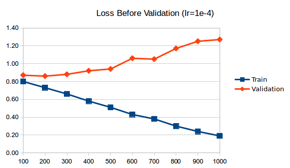
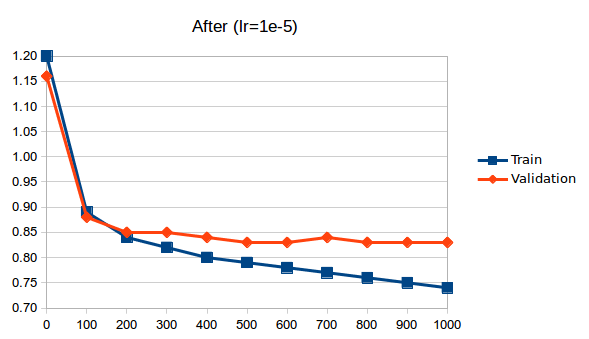

# gpt-2-simple

Addition of validation function from Neil Shepperd's GPT-2 [package](https://github.com/nshepperd/gpt-2) to Max Woolf's GPT-2 [package](https://github.com/minimaxir/gpt-2-simple).

